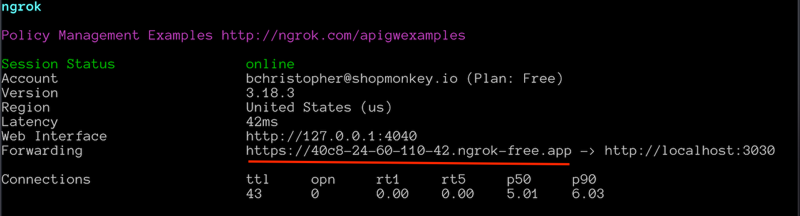
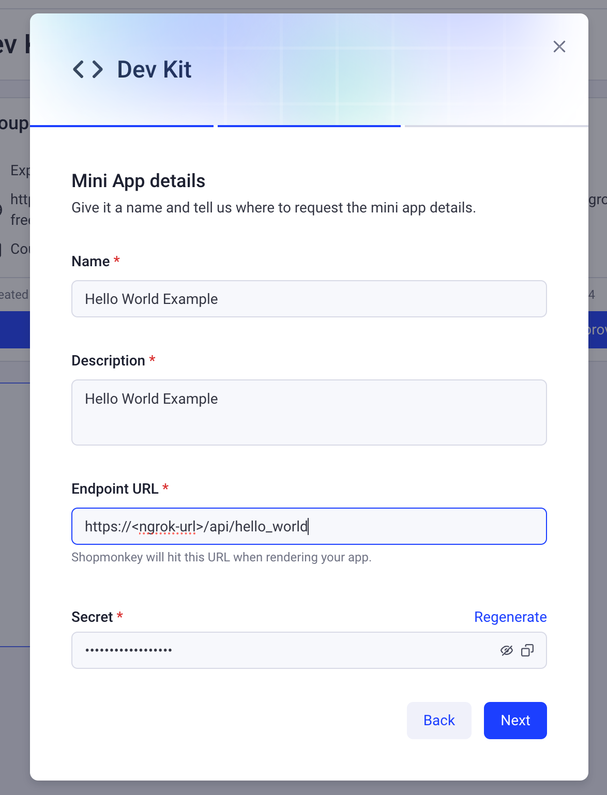
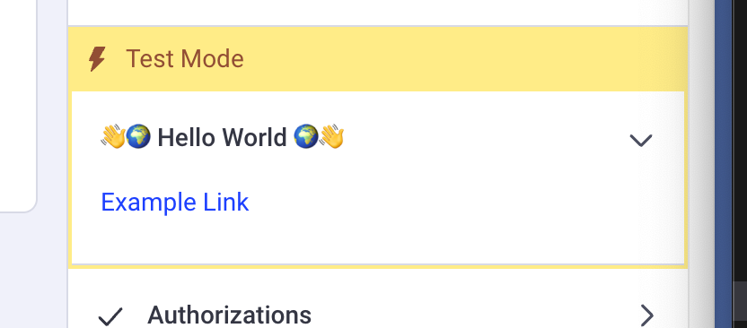

# devkit-examples

This app has no ui, it's just a simple api server.

- [API routes](https://nextjs.org/docs/api-routes/introduction) can be accessed on [http://localhost:3030/api/hello](http://localhost:3000/api/hello). This endpoint can be edited in `pages/api/hello.ts`.

First, run the development server:

```bash
npm run dev
# or
yarn dev
# or
pnpm dev
# or
bun dev
```

Next run ngrok to expose your local api to the internet:

- Install ngrok:
  [Getting Started with ngrok](https://ngrok.com/docs/getting-started/)
- Setup your ngrok auth token:

  - Sign up for an account and get your auth token: https://dashboard.ngrok.com/get-started/setup/macos

  ```bash
  ngrok config add-authtoken <your-auth-token>
  ```

- Run ngrok:
  ```bash
  ngrok http 3030
  ```
- Retrieve your ngrok url from the terminal

  

- Ping your ngrok url to test the api:
  ```bash
  curl https://<ngrok-url>/api/ping
  ```
- You can now use this url to create a mini app in HQ that connects to your api

  ```bash
  https://<ngrok-url>/api/hello_world
  ```

  

- If configured correctly, you should see the mini app on your selected page in Shop
  
